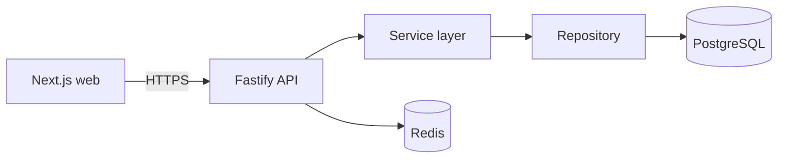

# Switchyard

> Feature flags for teams that ship continuously: turn a feature on for a chosen slice of
> users in production without a deploy. See [SPEC.md](SPEC.md) and [UX.md](UX.md).

**Live demo:** <link> · **API docs:** <link>/docs · **CI:** 

## Architecture



Layers run one way only: route → service → repository → database. A route never queries;
a repository never decides. The evaluation engine (`packages/engine`) sits beside the
layers, not in them: it is pure, imports neither the database nor HTTP, and the API and
the SDK run the same copy of it.

**Propagation.** A trigger bumps an environment's `ruleset_version` on every change and
calls `pg_notify('ruleset_changed', <environment id>)`. Every API instance LISTENs on one
dedicated connection, re-reads the changed ruleset once per burst, and pushes it to its
open `/v1/stream` connections. The SDK holds one stream; its first event is always the
current ruleset, so reconnecting is also a full resync.

## Trade-offs

| Decision | Chosen | Alternative | Why |
| --- | --- | --- | --- |
| Validation | Zod schemas shared by web and API | hand-written checks | One contract, parsed at the boundary, reused as the OpenAPI spec |
| Pagination | keyset cursor | `OFFSET` | Stable under concurrent inserts and stays fast on large tables |
| Primary key | `uuid` | `serial` | Ids are not guessable and not enumerable in URLs |
| Timestamps | `timestamptz` | `timestamp` | Bare `timestamp` silently drops the offset and breaks across regions |
| Error detail | field-level on 4xx, opaque on 5xx | uniform messages | Clients can fix their request; internals never leak |
| Evaluation | in the SDK, from a cached ruleset | one API call per check | Microseconds per check, keeps working when the API is down (SPEC.md) |
| Key storage | SHA-256 only, plaintext shown once | encrypted at rest | A database leak yields no working credential; nothing needs to be decrypted |
| Auth cache | 30 s TTL, dropped on local revoke | lookup per request | Off the hot path, still inside SPEC.md's 60 s revocation bound (D4) |
| Size limits | 422 `{error, limit, actual}` | 400 with the rest | The request is well-formed, just bigger than allowed; the client needs the number |
| Fan-out | PostgreSQL LISTEN/NOTIFY from the version trigger | Redis pub/sub | Delivered on commit and only on commit, by the same trigger that bumps the version, so no write path can skip it and a crash between commit and publish cannot drop a change. No extra service to run |
| SDK transport | `fetch` + hand-rolled SSE parser | `EventSource` | EventSource cannot send `Authorization` and reconnects on its own schedule; the SDK needs both under its control (backoff, jitter, idle timeout) |

## Results

Stage 6, measured on one 4-core / 16 GB container running PostgreSQL 17, the built API
(`node dist/server.js`, production settings) and the load generator together, so these
are lower bounds. Run with `pnpm --filter @switchyard/api test:load` (about 7 minutes).

| # | Target | Measured |
| --- | --- | --- |
| F1 | `GET /v1/ruleset` p99 < 50 ms at 500 rps | 500 flags (171 KiB), 60 s open-loop, a flag changing every 2 s: p50 1.7 ms, p99 23–31 ms, 0 errors |
| F2 | 1,000,000 checks < 1 s | 467–637 ms through the SDK's `variant()` (1.6–2.1 M/s) |
| F3 | 1,000 SSE connections, 5 min, no leak | all 1,000 open at 300 s, ≥ 10 pings each; two pushes reached all clients in 815 and 647 ms; server fds 63 → 1,063 → 33 after close; RSS flat at 107–112 MiB |

F1 needs 40 client keys: the ruleset limit of 1,000 requests/minute per key caps one key
at about 17 rps.

## Stack

pnpm workspaces · Next.js · Fastify · PostgreSQL (Drizzle) · Redis · Vitest · Playwright · GitHub Actions · Docker · Fly.io / Vercel

## Layout

```
apps/web          Next.js frontend; app/examples-list.tsx is the five-state reference
apps/api/src
  app.ts          Fastify wiring: helmet, CORS, rate limit, error handler
  env.ts          Environment parsed and validated at startup
  db/             Drizzle schema, client, migration runner
  evaluation/     re-export of @switchyard/engine
  stream/         change feed (LISTEN) and stream service (limits, heartbeats, fan-out)
  http/           route registration, SSE sink and shared response schemas
  auth/           key generation and hashing, principal, auth service with TTL cache
  projects/ flags/ keys/ audit/ ruleset/ environments/
                  one slice each: *.repository.ts (read/write) and *.service.ts (decide)
  container.ts    wires repositories into services
apps/api/test             Unit tests; no database
apps/api/test-integration Integration tests; real PostgreSQL required
packages/shared   Zod request/response contracts shared by web, api and sdk
packages/engine   pure evaluation engine: murmur3 bucketing, rule matching
packages/sdk      client: in-memory ruleset, local evaluation, SSE with backoff
packages/config   Base tsconfig
```

## Setup

```bash
pnpm install
cp .env.example .env                            # set SWITCHYARD_ROOT_KEY
docker compose up -d                            # Postgres + Redis
pnpm --filter @switchyard/api db:migrate
pnpm -r --parallel run dev                      # web :3000, api :4000
```

## Scripts

| Command | What it does |
| --- | --- |
| `pnpm -r run lint` | ESLint |
| `pnpm -r run typecheck` | TypeScript strict check |
| `pnpm -r run test` | Vitest unit tests, no database |
| `pnpm --filter @switchyard/api test:integration` | Integration tests against real PostgreSQL |
| `pnpm --filter @switchyard/web e2e` | Playwright E2E |
| `pnpm --filter @switchyard/api openapi` | Regenerate `openapi.json` |
| `pnpm --filter @switchyard/api db:generate` | Create a migration from the schema |

On Windows, run the `pnpm -r` forms above. The root aggregate scripts (`pnpm test`,
`pnpm build`) fail under some pnpm shims that cannot spawn a nested pnpm; CI runs Linux
and is unaffected.

## SDK

```ts
import { Switchyard } from '@switchyard/sdk';

const client = new Switchyard({ apiKey, baseUrl, fallbacks: { 'new-checkout': 'control' } });
await client.ready();                                  // first ruleset, or timeout; never rejects
client.variant('new-checkout', { key: userId, plan }); // string, never throws
client.enabled('dark-mode', { key: userId });          // boolean, never throws
client.close();
```

Reconnects back off 1 s, 2 s, 4 s … 30 s with ±20% jitter, resetting only after a
connection that stayed up 30 s. A stream silent for 75 s (two missed pings) is replaced.
A 401/403 stops retrying; evaluation carries on from the cached ruleset or fallbacks.

## Database migrations

Migrations are forward-only SQL in `apps/api/drizzle/`, applied in journal order.

- **Apply:** `pnpm --filter @switchyard/api db:migrate`
- **Never edit an applied migration.** Add a new one; editing desynchronizes the journal
  against databases that already ran it.
- **Rollback:** write a new forward migration that reverses the change, and deploy it the
  same way. Drizzle generates no `down` step, so this is the only reversal path.
- **Destructive changes** (dropping or narrowing a column) ship in two releases: first
  deploy code that stops using the column, then drop it in the next release. A single
  release makes rollback lossy.
- CI applies every migration to an empty PostgreSQL before the integration tests, so a
  migration that does not apply fails the build.

## Security baseline

Verified by tests in `apps/api/test/app.test.ts` and `apps/api/test-integration/auth.test.ts`:

- Helmet security headers, CORS restricted to `CORS_ORIGINS`, rate limiting, `BODY_LIMIT`.
- Every request body and query parsed by a Zod schema at the boundary.
- 5xx responses never carry the internal message; 4xx carry field-level detail.
- All queries parameterized through Drizzle; no string-built SQL.
- Secrets come from the environment, validated at startup in `env.ts`. `.env` is gitignored.
- CI runs `pnpm audit --audit-level high` and a gitleaks secret scan.

**Authorization.** Every `/v1` route authenticates in an `onRequest` hook, before the body
is parsed, with `Authorization: Bearer <key>`. Keys belong to one environment and carry a
scope: `admin` keys use the Admin API for their own environment, `client` keys read only
`/v1/ruleset`. Creating projects and environments needs the root key
(`SWITCHYARD_ROOT_KEY`), because no environment-scoped key can create the environment it
would belong to. Services, not routes, decide access.

## Deploy

- **API (Fly.io):** `flyctl deploy --config apps/api/fly.toml --dockerfile apps/api/Dockerfile`.
  CI deploys on `main` when the repo variable `DEPLOY=true` and secret `FLY_API_TOKEN` are set.
  Roll back with `flyctl releases` then `flyctl deploy --image <previous>`.
- **Web (Vercel):** import the repo, set the root directory to `apps/web`, set `NEXT_PUBLIC_API_URL`.

## Using this as a template

Copy the repo, rename the `@switchyard/*` scope, rename the app in `apps/api/fly.toml`, then
replace the `examples` slice end to end: schema, repository, service, routes, contracts in
`packages/shared`, and the page in `apps/web/app`. Keep the layering and the five-state UI.
